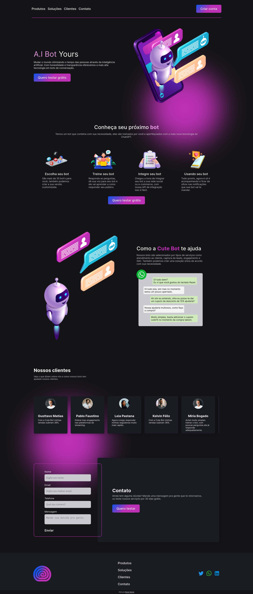

# 💡 Landing Page

Landing page realizada durante desafio da Lit Academy, foi proposto o desenvolvimento do layout de uma landing page para uma empresa de inteligencia artificial e essa é minha proposta.

__Você pode ver esse projeto rodando bem  [Aqui](https://dener-garcia.github.io/landing-page-lit-academy-reactJS/)__

__Veja todo o processo de design no  [Figma](https://www.figma.com/file/kXy0KV1Kd7vSAJ63zmtnnP/Landing-Page-Lit-Academy---Challenge?node-id=2717%3A223&t=C99c96ERvJmTHU4p-1)__


 🖥️ Versão web                                                    |  📱 Versão Mobile
:----------:                                                    |  :--------------:
  |  

## ⚙️ Funcionalidades

- ✅ Componentização com ReactJS
- ☑️ Estilização com modules.css
- ✅ Design responsivo
- ☑️ HTML semântico
- ✅ Design moderno
- ☑️ Uso de props nos componentes

## 🧰 Bibliotecas

- ✅ Eslint
- ☑️ gh-pages para deploy automatico

## ⬇️ Rodando o projeto

1. Clone esse repositório
2. Faça o downloado para sua máquina
3. Dentro da pasta insira os comandos abaixo
4. ```
    npm install
    npm run dev
    ```
6. Você deve ter o NodeJS instalado na sua máquina.

## 🧩 Tecnologías Utilizadas

<div align="left">
  
  
  
  
  
  
  
</div>

## 🤯 Aprendizados

Trabalhar com React separando os elementos em componentes, entender como o modules.css ajuda a não vazar estilização entre componentes, diferenças entre o HTML e JSX.


## 💬 Vamos nos conectar?

<div align="left">
  <a href="https://www.linkedin.com/in/denergarcia/" target="_blank">
    
  </a>
    
  <a href="https://www.youtube.com/@dener.criarbr" target="_blank">
    
  </a>
    
  <a href="https://www.instagram.com/dener.criarbr" target="_blank">
  
  </a>
    
  <a href="https://twitter.com/Dener_criarbr" target="_blank">
    
  </a>
    
  <a href="https://www.behance.net/dener-garcia" target="_blank">
    
  </a>
</div>
